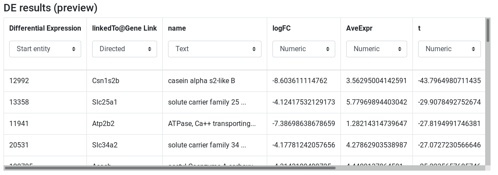
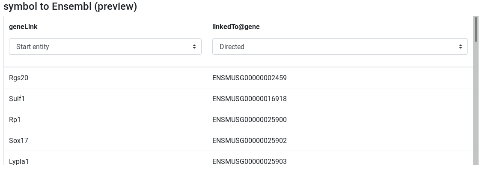
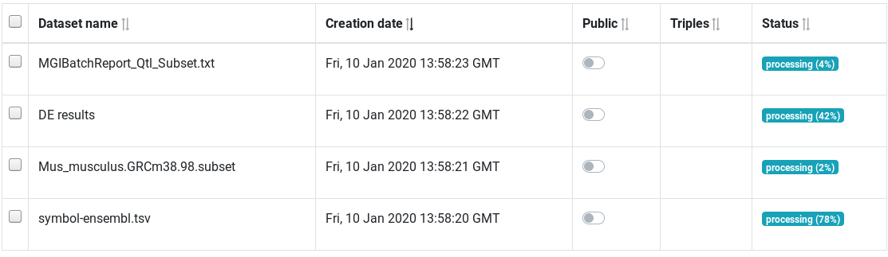
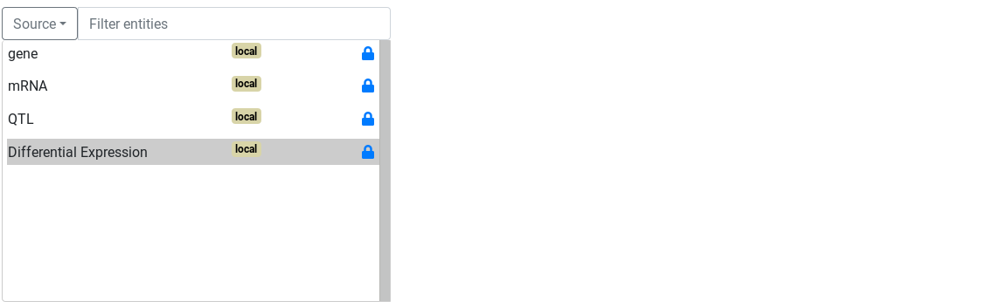
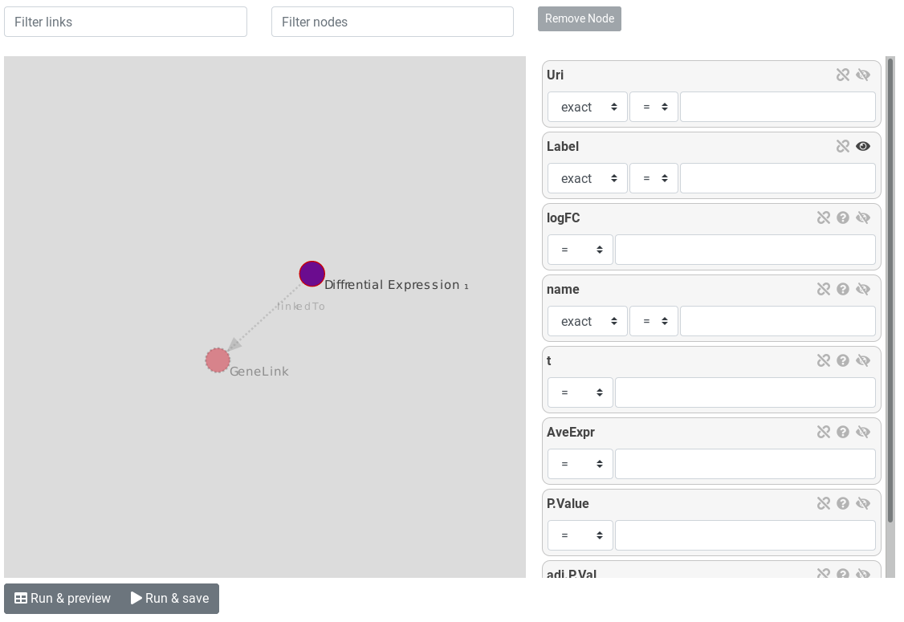

# Introduction
{:.no_toc}

<!-- AskOmics intro -->
AskOmics is a web software for data integration and query using the Semantic Web. It helps users to convert multiple data sources (CSV/TSV files, GFF and BED annotation) into RDF triples, and perform complex queries using a user-friendly interface.

<!-- AskOmics for RNA-Seq -->
AskOmics comes useful for cross-referencing results datasets with reference data. In RNA-Seq studies, we often need to filter the results on the fold change, to get the differentially expressed genes, and the p value, to get the significant results. then, the obtained results have to be mapped on reference genome to get the location on the genome. Other process can be done to know of the obtained genes are located on QTL related to a phenotype. All this process involve several tools and command line to parse the different data format, and to map datasets on other. AskOmics offer a solution to 1) convert the multiple format to one and 2) use a user-friendly interface to perform complex SPARQL queries on the RDF dataset.

<!-- The data -->
In this tutorial, We will use a file of differentially expressed results. This file is provided for you here. To generate the file yourself, see the [RNA-Seq counts to gene]({{ site.baseurl }}) tutorial. The file used here was generated from limma-voom but you could use a file from any RNA-seq differential expression tool, such as edgeR or DESeq2, as long as it has the required columns (see below).

The differentially expressed results will be mapped on mouse genome annotation, in general feature format (GFF). The file provided is a subset of the mouse annotation (GRCm38.p6) obtain from [Ensembl](http://www.ensembl.org/Mus_musculus/Info/Index).

In the differentially expressed file, gene are described by a symbol. In the annotation file, its an Ensembl id. To link the 2 datasets, we will need a file to map the gene symbol with Ensembl id.

Finally, we'll integrate a file about quantitative trait loci (QTL) to find if our differentially expressed genes are located inside QTL. This file is a subset of result query of [Mouse Genome Informatics](http://www.informatics.jax.org).

> ### Agenda
>
> In this tutorial, we will cover:
>
> 1. TOC
> {:toc}
>
{: .agenda}

# Preparing the inputs

We will use four files for this analysis:

 * **Differentially expressed results file** (genes in rows, and 4 required columns: identifier (ENTREZID), gene symbol (SYMBOL), log fold change (logFC) and adjusted P values (adj.P.Val))
 * **Reference genome annotation file** (in GFF format)
 * **Correspondence file between gene symbol and Ensembl id** (TSV of two columns: symbol and the corresponding Ensembl id)
 * **QTL file** (QTL in row, with 5 required columns: identifier, chromosome, start, end and name)

## Import data

> ###  Hands-on: Data upload
>
> 1. Create a new history for this RNA-seq exercise e.g. `RNA-seq AskOmics`
>
>    
>    
>
> 2. Import the files.
>
>    To import the files, there are two options:
>    - Option 1: From a shared data library if available (ask your instructor)
>    - Option 2: From [Zenodo](https://zenodo.org/record/3601076)
>
>    
>    
>
>    - You can paste the links below into the **Paste/Fetch** box:
>
>      ```
>      https://zenodo.org/record/2529117/files/limma-voom_luminalpregnant-luminallactate
>      https://zenodo.org/record/3601076/files/Mus_musculus.GRCm38.98.subset.gff3
>      https://zenodo.org/record/3601076/files/symbol-ensembl.tsv
>      https://zenodo.org/record/3601076/files/MGIBatchReport_Qtl_Subset.txt
>      ```
>
> 2. Rename the files using the  (pencil) icon.
>    - limma-voom_luminalpregnant-luminallactate to `DE results`
>    - Mus_musculus.GRCm38.98.subset.gff3 to `Mus musculus annotation`
>    - symbol-ensembl.tsv to `symbol to Ensembl`
>    - MGIBatchReport_Qtl_Subset.txt to `QTL`
>
> 3. Check every datatype.
>    - DE results: `tabular`
>    - Mus musculus annotation: `gff`
>    - symbol to Ensembl: `tabular`
>    - QTL: `tabular`
>
> If the datatypes are wrong, please change it.
>
> 
{: .hands_on}

Click on the  (eye) icon and take a look at the uploaded files.

# Upload inputs into AskOmics

## Launch AskOmics Interactive Tool

> ###  Hands-on: Launch AskOmics IT
> 1. **AskOmics** a visual SPARQL query builder  to launch the Interactive Tool
>    -  *"A dataset to load into AskOmics"*: `DE results`
{: .hands_on}

Wait for view until the tool is available, then click on the link to display the tool.


Once the Interactive Tool is launched, AskOmics display the start page. You can see that their is no data yet. Next step is to upload data

## Upload files from Galaxy to AskOmics

> ###  Hands-on: Upload files into AskOmics
> 1. **Files** page to see the uploaded files. There is only `DE results` for now.
> 2. **Galaxy**: select the `RNA-Seq AskOmics` history and select all files except `DE results`
> 3. **Upload**
{: .hands_on}


Now that all the files are on the AskOmics server, its time to integrate them!

# Integrate input files to AskOmics

AskOmics conversion into RDF is called *integration*.

> ###  Hands-on: Integrate data
> 1. **Files** page, select all the input files
> 2. **Integrate**
{: .hands_on}

The **Integrate** page show a preview of the data present in the file depending of the data type.

## Integrate GFF files

The GFF preview show the entities that the file contain. We can select the entity we want to be integrated.

> ###  Hands-on: Integrate `Mus musculus annotation`
> 1. Search for `Mus musculus annotation (preview)`
> 2. Select `gene` and `mRNA`
> 3. **Integrate (private dataset)**
>  
{: .hands_on}

## Integration of TSV files

The TSV preview show an HTML table representing the TSV file. During integration, AskOmics we will convert the file using the header.

<!-- First col: entity, then, attribute -->
The first column of a TSV file will be the *entity* name. Other columns of the file will be *attributes* of the *entity*. *Labels* of the *entity* and *attributes* will be set by the header. This *labels* can be edited by clicking on it.  

<!-- Attribute types -->
Entity and attributes can have special types. The types are defined with the select below the header. An *entity* can be a *start entity* or an *entity*. A *start entity* mean that the entity may be used to start a query.

Attributes can take the following types:
- Numeric: if all the values are numeric
- Text: if all the values are strings
- Category: if there is a limited number of repeated values

If the entity describe a locatable element on a genome:
- Reference: chromosome
- Strand: strand
- Start: start position
- End: end position

<!-- Relation -->
A columns can also be a relation between the *entity* to another. In this case, the header have to be `relationName@TargetedEntity` and the type *Directed* or *Symmetric* relation. a *Directed* relation is a relation from this entity to the targeted one. A *Symetric relation* is a relation on both directions.

> ###  Hands-on: Integrate `DE results`
> 1. Search for `DE results (preview)`
> 2. Edit attribute names and types:
>   - change `ENTREZ ID` to `Differential Expression` and set type to *start entity*
>   - change `SYMBOL` to `linkedTo@GeneLink` and set type to *Symmetric relation*
>   - change `GENENAME` to `name` and set type to *text*
>   - Keep the other column names and set their types to *numeric*
> 3. **Integrate (private dataset)**
>   
{: .hands_on}

> ###  Hands-on: Integrate `Symbol to Ensembl`
> 1. Search for `Symbol to Ensembl (preview)`
> 2. Edit attribute names and types:
>   - change `symbol` to `GeneLink` and set type to *entity*
>   - change `ensembl` to `linkedTo@gene` and set type to *Symmetric relation*
> 3. **Integrate (private dataset)**
>   
{: .hands_on}

> ###  Hands-on: Integrate `QTL`
> 1. Search for `QTL (preview)`
> 2. Edit attribute names and types:
>   - change `Input` to `QTL` and set type to *start entity*
>   - set `Chr` type to *Reference*
>   - set `Start` type to *Start*
>   - set `End` type to *End*
> 3. **Integrate (private dataset)**
>   
{: .hands_on}

Integration can take some times depending on the file size. The **Datasets** page show the progress.

> ###  Hands-on: track integration progress
> 1. Go to **Dataset** page
> 2. Wait for all datasets to be *success*
>   
{: .hands_on}

# Query

Once all the data of interest are integrated (converted to RDF graphs), its time to query them. Querying rdf data is done by the SPARQL language. AskOmics have a user-friendly interface to build SPARQL queries without knowing SPARQL language.

## Query builder overview

### Simple query

The first step to build a query is to choose a start point for the query.




> ###  Hands-on: Start a query
> 1. Go to **Ask!** page
> 2. Select the *Differential Expression* entity
> 3. **Start!**
{: .hands_on}


Once the start entity is chosen, the query builder is displayed.


The query builder is composed of a graph. Nodes represents *entities* and links represents *relations* between entities. The selected entity is surrounded by a red circle. links and other entities are dotted and lighter because there are not instantiated.



On the right, attributes of the selected entity are displayed as attribute boxes. Each boxes have an eye icon. Open eye mean the attribute will be displayed on the results.

> ###  Hands-on: Ask for all Differential Expression and display some attributes
> 1. Display `logFC` and `adj.P.val` by clicking on the eye icon
> 2. **Run & preview**
{: .hands_on}


**Run & preview** launch the query with a limit of 30 rows returned. We use this button to get an idea of the results returned.


### Filter on attributes

Next query will search for all over-expressed genes. Genes are considered over-expressed if the log fold change is > 2. We are oly interested by  significant results (Adj P value ≤ 0.05)

Back to the query builder, 

> ###  Hands-on: Filter attributes to get significant over-expressed genes
> 1. Filter `logFC` with `> 2`
> 2. Filter `adj.P.val` with `≤ 0.05`
> 2. **Run & preview**
{: .hands_on}

The preview show only significantly over-expressed genes.


### Filter on relations

now that we have our genes if interest, we will link these genes to the reference genome to get information about location.

To constraint on relation, we have to click on suggested nodes, linked to our entity of interest.

> ###  Hands-on: Link `De results` to `gene` using `GeneLink`
> 1. First, hide `Label`, `logFC` and `adj.P.val` of `Differential Expression`
> 2. Instantiate `GeneLink`, and hide `Label`
> 3. Instantiate `gene`
> 2. **Run & preview**
{: .hands_on}

Results now show the Ensembl id of our over-expressed genes. We have now access to all the information about the `gene` entity containing on the GFF file. for example, we can filter on chromosome and display chromosome and strand to get information about gene location.

> ###  Hands-on: Filter `gene`
> 1. Show `reference` and `strand` using the eye icon
> 2. Filter `reference` to select `X` and `Y` chromosomes (use `ctrl`+`click` to multiple selection)
> 2. **Run & preview**
{: .hands_on}


### Use FALDO ontology to query on the position of elements on the genome.

The [FALDO](https://bioportal.bioontology.org/ontologies/FALDO) ontology describe sequence feature positions and regions. AskOmics use FALDO ontology to represent entity positions. GFF are using FALDO, as well as TSV entities with chromosome, strand, start and end.

The FALDO ontology are used in AskOmics to perform special queries between 2 FALDO entities. These queries are:

- Entity included in another entity
- Entity overlapping another one

On the query builder interface, FALDO entities are represented with a green circle and FALDO relations have a green arrow.

> ###  Hands-on: Filter `gene`
> 1. First, remove the reference filter (unselect `X` and `Y` using `ctrl`+`click`)
> 2. Hide `strand` using the eye
> 3. Instantiate `QTL`
> 4. Click on the link between `gene` and `QTL` to edit the relation
> 5. check that the relation is `gene` `included in` `QTL` `on the same reference` with `strict` ticked
> 7. **Run & preview**
{: .hands_on}


To go further, we can filter on `QTL` to refine the results.


> ###  Hands-on: Filter `gene`
> 1. got back to the `QTL` node
> 2. Show the `Name` attribute using the eye icon
> 3. Filter the name with a `regexp` with `growth`
> 4. **Run & preview**
{: .hands_on}

From now, our query is "All Genes that are over-expressed (logFC > 2 and FDR ≤ 0.05) and located on a QTL that are related to growth" This is the results that we are looking for. So we can save it.

> ###  Hands-on: Save a result
> 1. **Run & save**
> 2. Got to the **Results** page
{: .hands_on}


## Results management

The results page store the saved queries. A table show some useful information about the queries. Query name can be edited by clicking on it.


> ###  Hands-on: Edit query name
> 1. Click on the name and enter `Over-expressed genes on a growth QTL`
> 2. press `enter` key
{: .hands_on}

The **Action** column contain button to perform certain action:

- Preview: show a results preview on the bottom of the table
- Download: Download the results (TSV file)
- Edit: Edit the query with the query builder
- SPARQL: edit the query with a SPARQL editor for advanced users
- Send results to Galaxy: send the results (TSV file) to the most recently used Galaxy history
- Send query to Galaxy: send the query representation (json file) to the most recently used Galaxy history

> ###  Hands-on: Send results to Galaxy
> 1. Click on **Send results to Galaxy**
> 2. Get back to galaxy and wait for the dataset
{: .hands_on}


# Conclusion
{:.no_toc}

In this tutorial we have seen how to use AskOmics Interactive Tool to Build a complex SPARQL query to interrogate 4 different datasets and answer a biological question.
